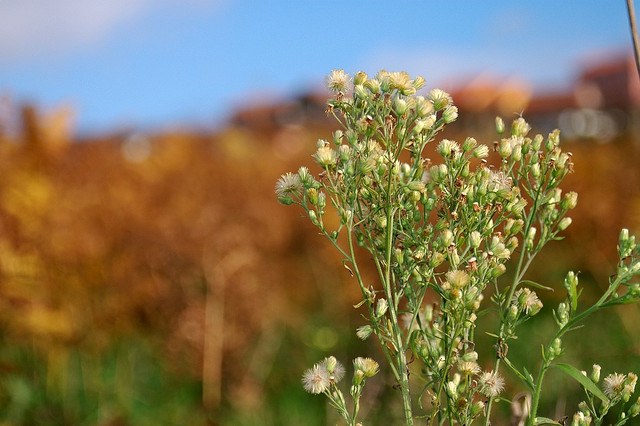

Honeycombs jQuery Plugin
========================

Example: http://examples.rabbid.net/honeycombs/demo.html

jQuery plugin for displaying images in a responsive honeycomb grid with caption support

To generate a honeycomb grid, use the following markup:

```
<script src="http://ajax.googleapis.com/ajax/libs/jquery/1.10.2/jquery.min.js"></script>
<script src="homeycombs/js/jquery.homeycombs.js"></script>

<div class="honeycombs">
		<div class="comb">
			
			<span><b>This is</b><br> a test</span>
		</div>
		<div class="comb">
			
			<span><b>This is</b><br> a test</span>
		</div>
</div>
```

If you want to assign the honeycomb plugin to another class but .honeycomb, use the following snipped inside a javascript file:

```
(function($) {
	$(document).ready(function() {
        $('.honeycombs').honeycombs();
    });
}(jQuery));
```